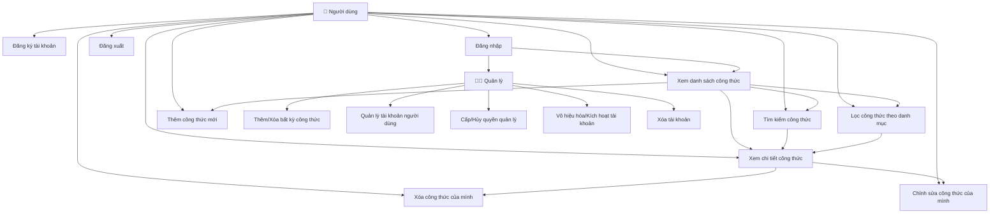
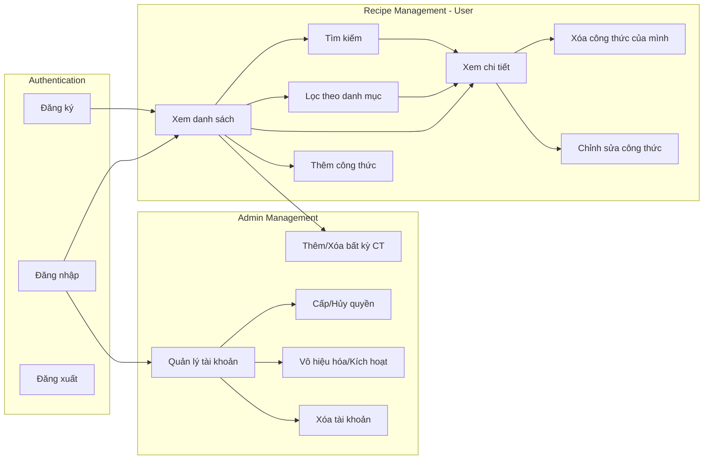

# BÁO CÁO ỨNG DỤNG COOKING GUIDE
## Ứng dụng Công thức Nấu ăn trên Android

---

## MỤC LỤC

1. [Tổng quan dự án](#1-tổng-quan-dự-án)
2. [Kiến trúc hệ thống](#2-kiến-trúc-hệ-thống)
3. [Sơ đồ Use Case](#3-sơ-đồ-use-case)
4. [Phân tích chức năng](#4-phân-tích-chức-năng)
5. [Công nghệ sử dụng](#5-công-nghệ-sử-dụng)
6. [Cấu trúc dự án](#6-cấu-trúc-dự-án)
7. [Giao diện người dùng](#7-giao-diện-người-dùng)
8. [Kết luận](#8-kết-luận)

---

## 1. TỔNG QUAN DỰ ÁN

### 1.1. Giới thiệu

**Cooking Guide** là ứng dụng di động được phát triển bằng Flutter, cho phép người dùng:
- Quản lý và xem các công thức nấu ăn
- Tìm kiếm công thức theo tên hoặc mô tả
- Lọc công thức theo danh mục
- Xem chi tiết công thức với nguyên liệu và các bước thực hiện

### 1.2. Mục tiêu dự án

- Cung cấp nền tảng dễ sử dụng để quản lý công thức nấu ăn
- Tích hợp Firebase để lưu trữ dữ liệu và xác thực người dùng
- Giao diện hiện đại, thân thiện với người dùng
- Hỗ trợ tìm kiếm và lọc công thức hiệu quả

### 1.3. Phạm vi ứng dụng

- **Platform**: Android (có thể mở rộng sang iOS, Web)
- **Đối tượng sử dụng**: Người dùng cá nhân quan tâm đến nấu ăn
- **Chức năng chính**: Quản lý, tìm kiếm và xem công thức nấu ăn

---

## 2. KIẾN TRÚC HỆ THỐNG

### 2.1. Kiến trúc tổng quan

```
┌─────────────────────────────────────────────────────────┐
│                    FLUTTER APP                          │
├─────────────────────────────────────────────────────────┤
│  ┌──────────────┐  ┌──────────────┐  ┌──────────────┐ │
│  │   Screens    │  │   Widgets    │  │   Services   │ │
│  │              │  │              │  │              │ │
│  │ - Login      │  │ - RecipeCard │  │ - Firebase   │ │
│  │ - Home       │  │              │  │   Service    │ │
│  │ - Detail     │  │              │  │              │ │
│  └──────────────┘  └──────────────┘  └──────────────┘ │
│         │                  │                  │        │
│         └──────────────────┴──────────────────┘        │
│                         │                               │
│                  ┌──────────────┐                      │
│                  │   Models     │                      │
│                  │ - Recipe      │                      │
│                  └──────────────┘                      │
└─────────────────────────│───────────────────────────────┘
                          │
                          ▼
┌─────────────────────────────────────────────────────────┐
│                    FIREBASE BACKEND                     │
├─────────────────────────────────────────────────────────┤
│  ┌──────────────┐          ┌──────────────┐           │
│  │   Firebase   │          │  Cloud       │           │
│  │   Auth       │          │  Firestore   │           │
│  │              │          │              │           │
│  │ - Login      │          │ - Recipes    │           │
│  │ - Signup     │          │   Collection │           │
│  └──────────────┘          └──────────────┘           │
└─────────────────────────────────────────────────────────┘
```

### 2.2. Luồng dữ liệu

1. **Xác thực người dùng**: Login Screen → Firebase Auth → Home Screen
2. **Tải công thức**: Home Screen → Firebase Service → Firestore → Hiển thị
3. **Xem chi tiết**: Home Screen → Recipe Detail Screen

---

## 3. SƠ ĐỒ USE CASE

### 3.1. Sơ đồ Use Case tổng quan



### 3.2. Mô tả Use Case

#### UC1: Đăng ký tài khoản
- **Actor**: Người dùng chưa có tài khoản
- **Mô tả**: Người dùng tạo tài khoản mới bằng email và mật khẩu
- **Precondition**: Ứng dụng đã được mở
- **Postcondition**: Tài khoản được tạo, người dùng được đăng nhập tự động
- **Luồng chính**:
  1. Người dùng nhập email và mật khẩu
  2. Hệ thống validate dữ liệu
  3. Gửi yêu cầu đăng ký đến Firebase Auth
  4. Tài khoản được tạo thành công
  5. Chuyển đến màn hình chính

#### UC2: Đăng nhập
- **Actor**: Người dùng đã có tài khoản
- **Mô tả**: Người dùng đăng nhập vào hệ thống
- **Precondition**: Người dùng đã có tài khoản
- **Postcondition**: Người dùng được xác thực và chuyển đến màn hình chính
- **Luồng chính**:
  1. Người dùng nhập email và mật khẩu
  2. Hệ thống validate dữ liệu
  3. Gửi yêu cầu đăng nhập đến Firebase Auth
  4. Xác thực thành công
  5. Chuyển đến màn hình chính

#### UC3: Xem danh sách công thức
- **Actor**: Người dùng đã đăng nhập
- **Mô tả**: Hiển thị danh sách tất cả công thức nấu ăn
- **Precondition**: Người dùng đã đăng nhập
- **Postcondition**: Danh sách công thức được hiển thị
- **Luồng chính**:
  1. Hệ thống tải danh sách công thức từ Firestore
  2. Hiển thị danh sách dưới dạng cards
  3. Mỗi card hiển thị: hình ảnh, tên, mô tả, số nguyên liệu và bước

#### UC4: Tìm kiếm công thức
- **Actor**: Người dùng đã đăng nhập
- **Mô tả**: Tìm kiếm công thức theo từ khóa
- **Precondition**: Đang ở màn hình danh sách công thức
- **Postcondition**: Hiển thị kết quả tìm kiếm
- **Luồng chính**:
  1. Người dùng nhập từ khóa vào ô tìm kiếm
  2. Hệ thống lọc danh sách theo tên hoặc mô tả
  3. Hiển thị kết quả tìm kiếm

#### UC5: Lọc công thức theo danh mục
- **Actor**: Người dùng đã đăng nhập
- **Mô tả**: Lọc công thức theo danh mục (Món chính, Món phụ, Tráng miệng, v.v.)
- **Precondition**: Đang ở màn hình danh sách công thức
- **Postcondition**: Hiển thị công thức theo danh mục đã chọn
- **Luồng chính**:
  1. Người dùng chọn danh mục từ danh sách chips
  2. Hệ thống lọc danh sách theo danh mục
  3. Hiển thị kết quả đã lọc

#### UC6: Xem chi tiết công thức
- **Actor**: Người dùng đã đăng nhập
- **Mô tả**: Xem thông tin chi tiết của một công thức
- **Precondition**: Đang ở màn hình danh sách công thức
- **Postcondition**: Hiển thị chi tiết công thức
- **Luồng chính**:
  1. Người dùng nhấn vào một công thức
  2. Hệ thống chuyển đến màn hình chi tiết
  3. Hiển thị: hình ảnh, mô tả, danh sách nguyên liệu, các bước thực hiện

#### UC7: Đăng xuất
- **Actor**: Người dùng đã đăng nhập
- **Mô tả**: Đăng xuất khỏi tài khoản
- **Precondition**: Người dùng đã đăng nhập
- **Postcondition**: Người dùng được đăng xuất và quay về màn hình đăng nhập
- **Luồng chính**:
  1. Người dùng nhấn nút đăng xuất
  2. Hệ thống xác nhận
  3. Đăng xuất khỏi Firebase Auth
  4. Chuyển về màn hình đăng nhập

#### UC8: Thêm công thức mới
- **Actor**: Người dùng đã đăng nhập
- **Mô tả**: Người dùng thêm công thức nấu ăn mới vào hệ thống
- **Precondition**: Người dùng đã đăng nhập
- **Postcondition**: Công thức mới được thêm vào Firestore
- **Luồng chính**:
  1. Người dùng nhấn nút "Thêm công thức"
  2. Hệ thống hiển thị form nhập liệu
  3. Người dùng nhập: tên, mô tả, hình ảnh, danh mục, nguyên liệu, các bước
  4. Hệ thống validate dữ liệu
  5. Lưu công thức vào Firestore với userId của người tạo
  6. Hiển thị thông báo thành công và cập nhật danh sách

#### UC9: Xóa công thức của mình
- **Actor**: Người dùng đã đăng nhập (chủ sở hữu công thức)
- **Mô tả**: Người dùng xóa công thức mà mình đã tạo
- **Precondition**: 
  - Người dùng đã đăng nhập
  - Công thức thuộc về người dùng (userId khớp)
- **Postcondition**: Công thức được xóa khỏi Firestore
- **Luồng chính**:
  1. Người dùng nhấn nút xóa trên công thức của mình
  2. Hệ thống kiểm tra quyền (userId khớp)
  3. Hiển thị dialog xác nhận
  4. Người dùng xác nhận xóa
  5. Xóa công thức khỏi Firestore
  6. Cập nhật danh sách

#### UC10: Chỉnh sửa công thức của mình
- **Actor**: Người dùng đã đăng nhập (chủ sở hữu công thức)
- **Mô tả**: Người dùng chỉnh sửa công thức mà mình đã tạo
- **Precondition**: 
  - Người dùng đã đăng nhập
  - Công thức thuộc về người dùng
- **Postcondition**: Công thức được cập nhật trong Firestore
- **Luồng chính**:
  1. Người dùng nhấn nút chỉnh sửa trên công thức của mình
  2. Hệ thống mở form với dữ liệu hiện tại
  3. Người dùng chỉnh sửa thông tin
  4. Hệ thống validate và lưu cập nhật
  5. Cập nhật danh sách

#### UC11: Thêm/Xóa bất kỳ công thức (Quản lý)
- **Actor**: Quản lý (Admin)
- **Mô tả**: Quản lý có thể thêm hoặc xóa bất kỳ công thức nào trong hệ thống
- **Precondition**: Người dùng có role là "admin"
- **Postcondition**: Công thức được thêm/xóa thành công
- **Luồng chính**:
  1. Quản lý đăng nhập với tài khoản admin
  2. Quản lý có thể thêm công thức mới (giống UC8)
  3. Quản lý có thể xóa bất kỳ công thức nào (không cần kiểm tra userId)
  4. Hệ thống kiểm tra role admin và cho phép thao tác

#### UC12: Quản lý tài khoản người dùng
- **Actor**: Quản lý (Admin)
- **Mô tả**: Quản lý xem danh sách tất cả người dùng trong hệ thống
- **Precondition**: Người dùng có role là "admin"
- **Postcondition**: Danh sách người dùng được hiển thị
- **Luồng chính**:
  1. Quản lý nhấn nút "Quản lý tài khoản"
  2. Hệ thống kiểm tra role admin
  3. Tải danh sách tất cả users từ Firestore
  4. Hiển thị danh sách với thông tin: email, role, trạng thái

#### UC13: Cấp/Hủy quyền quản lý
- **Actor**: Quản lý (Admin)
- **Mô tả**: Quản lý cấp hoặc hủy quyền admin cho người dùng khác
- **Precondition**: 
  - Người dùng có role là "admin"
  - Đang ở màn hình quản lý tài khoản
- **Postcondition**: Role của người dùng được cập nhật
- **Luồng chính**:
  1. Quản lý chọn người dùng từ danh sách
  2. Nhấn menu và chọn "Cấp quyền quản lý" hoặc "Hủy quyền quản lý"
  3. Hệ thống cập nhật role trong Firestore
  4. Cập nhật danh sách

#### UC14: Vô hiệu hóa/Kích hoạt tài khoản
- **Actor**: Quản lý (Admin)
- **Mô tả**: Quản lý vô hiệu hóa hoặc kích hoạt tài khoản người dùng
- **Precondition**: 
  - Người dùng có role là "admin"
  - Đang ở màn hình quản lý tài khoản
- **Postcondition**: Trạng thái isActive của tài khoản được cập nhật
- **Luồng chính**:
  1. Quản lý chọn người dùng từ danh sách
  2. Nhấn menu và chọn "Vô hiệu hóa" hoặc "Kích hoạt"
  3. Hệ thống cập nhật isActive trong Firestore
  4. Cập nhật danh sách

#### UC15: Xóa tài khoản
- **Actor**: Quản lý (Admin)
- **Mô tả**: Quản lý xóa tài khoản người dùng khỏi hệ thống
- **Precondition**: 
  - Người dùng có role là "admin"
  - Đang ở màn hình quản lý tài khoản
  - Không phải tài khoản của chính mình
- **Postcondition**: Tài khoản được xóa khỏi Firestore
- **Luồng chính**:
  1. Quản lý chọn người dùng từ danh sách
  2. Nhấn menu và chọn "Xóa tài khoản"
  3. Hệ thống kiểm tra không phải tài khoản của chính mình
  4. Hiển thị dialog xác nhận
  5. Xóa user document khỏi Firestore
  6. Cập nhật danh sách

### 3.3. Sơ đồ Use Case chi tiết với mối quan hệ



---

## 4. PHÂN TÍCH CHỨC NĂNG

### 4.1. Màn hình đăng nhập/đăng ký (Login Screen)

**Chức năng:**
- Đăng nhập với email và mật khẩu
- Đăng ký tài khoản mới
- Chuyển đổi giữa chế độ đăng nhập và đăng ký
- Validation form
- Hiển thị/ẩn mật khẩu
- Xử lý lỗi chi tiết

**Thành phần:**
- Email input field
- Password input field với toggle visibility
- Submit button với loading state
- Toggle button để chuyển đổi giữa login/signup

### 4.2. Màn hình chính (Home Screen)

**Chức năng:**
- Hiển thị danh sách công thức
- Tìm kiếm công thức
- Lọc theo danh mục
- Pull-to-refresh
- Đăng xuất
- Thêm công thức mới (FAB)
- Quản lý tài khoản (nếu là admin)

**Thành phần:**
- Search bar
- Category filter chips
- Recipe cards list với nút xóa/chỉnh sửa
- User greeting
- Logout button
- Admin panel button (nếu là admin)
- FloatingActionButton để thêm công thức

### 4.3. Màn hình chi tiết công thức (Recipe Detail Screen)

**Chức năng:**
- Hiển thị hình ảnh công thức
- Hiển thị mô tả
- Danh sách nguyên liệu
- Các bước thực hiện

**Thành phần:**
- SliverAppBar với hình ảnh
- Description section
- Ingredients section với numbered list
- Steps section với numbered cards

### 4.4. Màn hình thêm/chỉnh sửa công thức (Add/Edit Recipe Screen)

**Chức năng:**
- Thêm công thức mới
- Chỉnh sửa công thức hiện có
- Nhập thông tin: tên, mô tả, hình ảnh, danh mục
- Thêm/xóa nguyên liệu động
- Thêm/xóa các bước thực hiện động
- Validation form

**Thành phần:**
- Form với các input fields
- Dynamic list cho nguyên liệu
- Dynamic list cho các bước
- Save button

### 4.5. Màn hình quản lý tài khoản (User Management Screen)

**Chức năng:**
- Xem danh sách tất cả người dùng (chỉ admin)
- Cấp/hủy quyền quản lý
- Vô hiệu hóa/kích hoạt tài khoản
- Xóa tài khoản

**Thành phần:**
- User list với avatar và thông tin
- Popup menu cho mỗi user
- Role badges
- Status indicators

### 4.6. Widget Recipe Card

**Chức năng:**
- Hiển thị preview công thức
- Hiển thị hình ảnh với placeholder
- Hiển thị thông tin: tên, mô tả, số nguyên liệu, số bước
- Badge danh mục
- Nút xóa (nếu có quyền)
- Nút chỉnh sửa (nếu là chủ sở hữu)
- Hiển thị tên người tạo

---

## 5. CÔNG NGHỆ SỬ DỤNG

### 5.1. Framework và ngôn ngữ

- **Flutter**: Framework đa nền tảng
- **Dart**: Ngôn ngữ lập trình (version 3.9.2+)
- **Material Design 3**: Design system

### 5.2. Backend và Database

- **Firebase Core**: 4.2.0
- **Firebase Authentication**: 6.1.1
  - Email/Password authentication
- **Cloud Firestore**: 6.0.3
  - Lưu trữ dữ liệu công thức

### 5.3. Công cụ phát triển

- **Android Studio**: IDE chính
- **Flutter SDK**: 3.35.7
- **Gradle**: 8.11.1
- **Android Gradle Plugin**: 8.9.1

### 5.4. Kiến trúc và Pattern

- **StatefulWidget**: Quản lý state
- **FutureBuilder**: Xử lý async data
- **Service Layer**: Tách biệt business logic
- **Model**: Data models

---

## 6. CẤU TRÚC DỰ ÁN

```
lib/
├── constants/
│   ├── app_colors.dart      # Định nghĩa màu sắc
│   └── app_styles.dart      # Định nghĩa styles
├── models/
│   ├── recipe_model.dart    # Model công thức (có userId, createdAt)
│   └── user_model.dart      # Model người dùng (có role: user/admin)
├── screens/
│   ├── login_screen.dart    # Màn hình đăng nhập/đăng ký
│   ├── home_screen.dart     # Màn hình chính
│   ├── recipe_detail_screen.dart # Màn hình chi tiết
│   ├── add_edit_recipe_screen.dart # Màn hình thêm/sửa công thức
│   └── user_management_screen.dart # Màn hình quản lý tài khoản (admin)
├── services/
│   └── firebase_service.dart # Service tương tác Firebase
│       - CRUD operations cho recipes
│       - User management (admin only)
│       - Permission checking
├── widgets/
│   └── recipe_card.dart     # Widget hiển thị card công thức
│       - Nút xóa/chỉnh sửa (nếu có quyền)
├── firebase_options.dart     # Cấu hình Firebase
└── main.dart                 # Entry point
```

### 6.1. Mô tả các module

**Constants:**
- `app_colors.dart`: Định nghĩa bảng màu nhất quán
- `app_styles.dart`: Định nghĩa typography và styles

**Models:**
- `recipe_model.dart`: Class Recipe với các thuộc tính và factory constructor

**Screens:**
- `login_screen.dart`: Xử lý authentication
- `home_screen.dart`: Quản lý danh sách và tìm kiếm
- `recipe_detail_screen.dart`: Hiển thị chi tiết công thức

**Services:**
- `firebase_service.dart`: Tương tác với Firebase (Auth và Firestore)

**Widgets:**
- `recipe_card.dart`: Widget tái sử dụng để hiển thị công thức

---

## 7. GIAO DIỆN NGƯỜI DÙNG

### 7.1. Design System

**Màu sắc:**
- Primary: #FF6B35 (Cam)
- Accent: #FFB84D (Vàng cam)
- Background: #F8F9FA (Xám nhạt)
- Surface: #FFFFFF (Trắng)
- Error: #E74C3C (Đỏ)

**Typography:**
- Heading 1: 32px, Bold
- Heading 2: 24px, Bold
- Heading 3: 20px, Semi-bold
- Body: 16px, Regular

### 7.2. Các màn hình

**Login Screen:**
- Gradient background
- Icon logo tròn
- Form với validation
- Toggle giữa login/signup

**Home Screen:**
- Custom app bar với greeting
- Search bar
- Category filter chips
- Recipe cards với shadow và rounded corners

**Recipe Detail Screen:**
- SliverAppBar với hình ảnh lớn
- Sections cho nguyên liệu và các bước
- Numbered lists với icons

---

## 8. KẾT LUẬN

### 8.1. Tóm tắt

Ứng dụng **Cooking Guide** đã được phát triển thành công với các chức năng chính:
- ✅ Xác thực người dùng với Firebase Auth
- ✅ Quản lý và hiển thị công thức nấu ăn
- ✅ Tìm kiếm và lọc công thức
- ✅ **Thêm công thức mới** (người dùng)
- ✅ **Xóa/chỉnh sửa công thức của mình** (người dùng)
- ✅ **Quản lý công thức** (admin - thêm/xóa bất kỳ)
- ✅ **Quản lý tài khoản người dùng** (admin)
- ✅ Giao diện hiện đại, thân thiện

### 8.2. Điểm mạnh

- Kiến trúc rõ ràng, dễ bảo trì
- Giao diện đẹp, UX tốt
- Xử lý lỗi chi tiết
- Code được tổ chức tốt
- **Hệ thống phân quyền rõ ràng** (user/admin)
- **Bảo mật tốt** - người dùng chỉ xóa được công thức của mình
- **Quản lý linh hoạt** - admin có toàn quyền

### 8.3. Hướng phát triển

- Thêm chức năng yêu thích
- Thêm đánh giá và bình luận
- Tối ưu hiệu năng và caching
- Hỗ trợ offline mode
- Thêm upload hình ảnh từ thiết bị
- Thêm thông báo push

---

**Ngày tạo báo cáo**: $(date +"%d/%m/%Y")  
**Phiên bản ứng dụng**: 1.0.0+1  
**Framework**: Flutter 3.35.7  
**Platform**: Android

